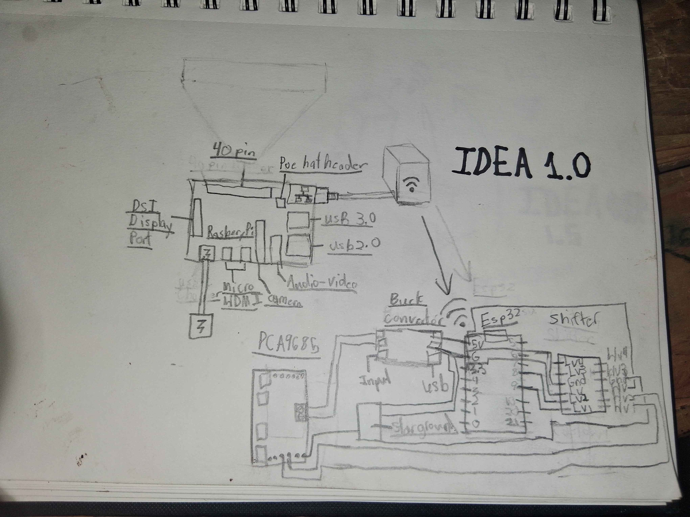
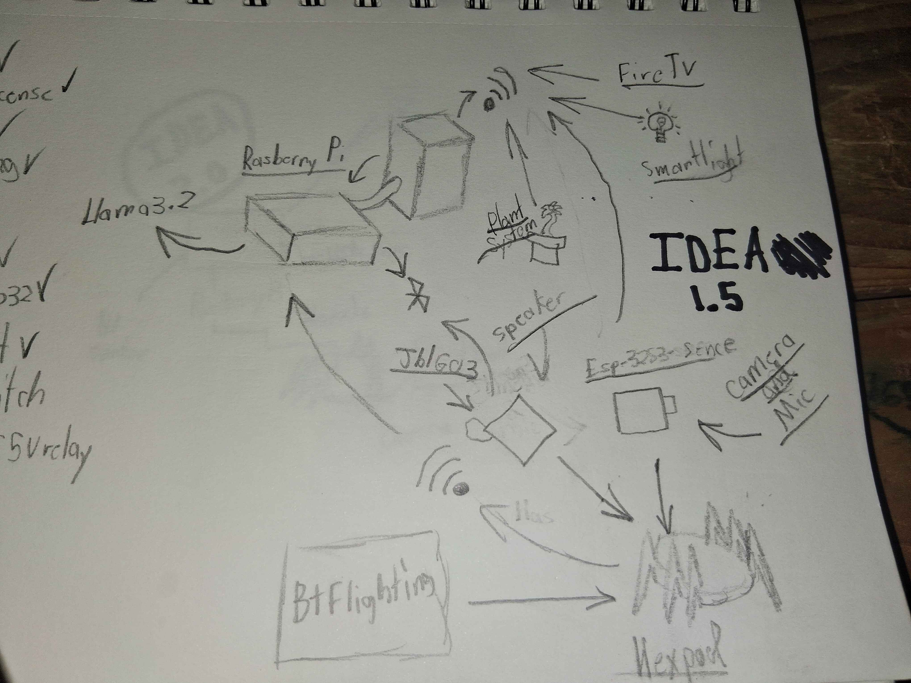

# My Engenering and Computing Journy
 Sup, I'm Connor Brinkley and this is documentation starting with my fist big project, and covering my High School Projects, and will be updated on any future works.
# Hexpod
This project I will be modifying a Freenove hexpod with a usb microphone, speaker, a 8 by 8 led screen, and a rasberry pi model 4 b. My end goal is to have an "Alexa on legs", It will use llm's for simple tasks and use an online ai for complexe ones.
## Blueprints
As you can see below these were earler blueprints i had made, each of these had their own compications.

  

    <!-- Replace left1.jpg and left2.jpg with your actual filenames in the images/ folder -->
    
    
  

  

     Here on the left you can see plan 1.0, this was my original plan for how the brain would work but i relised soon after this would be needlessly overcomplicated. 
     My second plan was 1.5, this had one big flaw. It relied too much on wiresless data, it one this failed to connect the entire project would be down.
  

