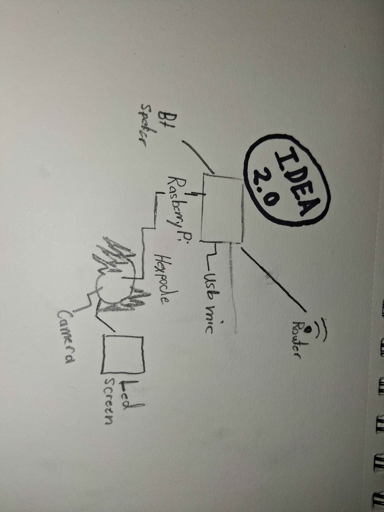
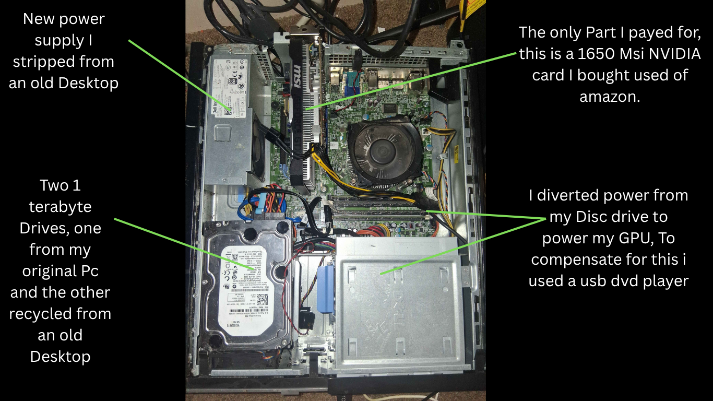

# My Engineering and Computing Journey
Welcome to my maker portfolio! This is documentation starting with my first big project and covering my high school projects, with updates on any future works.

# Hexpod
For this project, I will be modifying a Freenove Hexpod large model with a USB microphone, speaker, an 8 by 8 LED screen, and a Raspberry Pi Model 4B. My end goal is to have an "Alexa on legs." I plan to add voice controls and a dynamic controller I could use on both my phone and Steam Deck. It will use LLMs for simple tasks and an online AI for complex ones. I plan to document this not only for reference, but also so anyone could do the same thing. The end goal is to have an assistant to help me on my future projects or help anyone. I plan to make all parts I use public along with all scripts, and in my specific repository I will leave detailed instructions.

## Blueprints
Below are the earlier blueprints I made. Each of these had their own complications.

  

    <!-- Replace left1.jpg and left2.jpg with your actual filenames in the images/ folder -->
    
  

  

     Here on the left you can see Plan 1.0, my original plan for how the brain would work. I realized soon after that this would be unnecessarily overcomplicated. The point of this was to save on money, as the original Hexpod model I was planning on buying was not compatible with the Raspberry Pi. However, all the stuff I would have to spend to build this plan would greatly outweigh the extra cost of the Raspberry Pi-compatible Hexpod, which was an extra $50.
  

  

    
  

  

     My second plan was 1.5, still relying on the original Hexpod model. I made this to try to lower the total cost, but it had one big flaw. It relied too much on wireless data—if one of these failed to connect, the entire project would be down. Not only that, but it would not be easily replicable. The big issue, however, is that I would have to fully rework the system if I wanted to demonstrate or use the Hexpod outside my router's range. However, I do plan to reuse sections, like the smart home segments—specifically the smart lights, Fire TV controls, and the plant monitoring systems—as they will help by making my non-engineering aspects easier, so I can focus more on my work.
  

Here you can see my final blueprint.

This way, I will be using minimal parts to save on weight and replication. Everything will be running on the Raspberry Pi, and the only wireless connections will be WiFi and the speaker. I plan to disconnect the Hexpod's original LED and solder my own 8 by 8 LED board to it. This will help with both anthropomorphizing and debugging. I will be using a generic USB microphone and Bluetooth speaker. The Freenove Hexpod has a built-in camera, so that is covered. Code-wise, I haven't decided which LLM or speech-to-text model I will be using, but I plan to keep it free. I am first going to build the platform to control the Hexpod from any device, then I will map each control to a console command and give the AI the list of commands and their actions. I will add input from a speech-to-text model linked to the microphone. It will also receive around one low-quality frame every 2–3 seconds. Although I will also use scripts to track faces and certain objects, when needed I will increase the number of frames.

## Beginnings
So far I'm waiting for everything to arrive in the mail. I will update this section when needed.

# My First Project
Christmas 2017, my uncle gifted me an old desktop that his company was throwing away. To seven-year-old me, that was the best Christmas gift I could have ever gotten. Around 2021, the power supply gave out. I didn't know how to fix it, and at the time it was devastating. In retrospect, it was the best thing that could have happened to me. This was around when my school started to upgrade its software to Chromebooks, so after a bit of dumpster diving, I found an old desktop that the school had claimed was "worthless" and "broken." I brought it home and was able to diagnose my original power supply problem, and I was able to build this Frankenstein computer.

This is my pride and joy. Every design you will see here was researched, coded, designed, and planned on the recycled PC.
